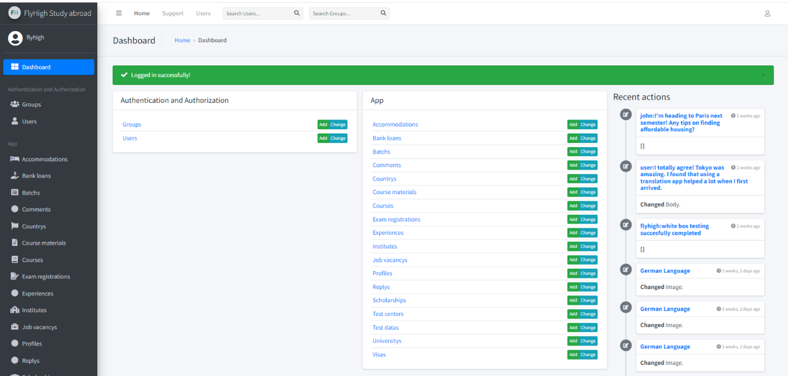

# ✈️ FlyHigh


---

## 📖 Description

**FlyHigh** is a Django-based educational consultancy and student management platform designed to simplify the higher education journey for students. The application provides a centralized system for managing courses, batches, exam registrations, scholarships, student visas, and accommodation information.

The platform enables students to explore academic opportunities, register for examinations, access scholarship and visa guidance, and find accommodation resources. Administrators can efficiently manage all content and services through Django's powerful administration panel.

---

## 🚀 Features

- 📚 Course Management
- 👨‍🎓 Student Batch Management
- 📝 Online Exam Registration
- 🎓 Scholarship Information Portal
- 🌍 Student Visa Guidance
- 🏠 Accommodation Information
- 🖼️ Media Upload Support
- 🔐 Secure Django Admin Panel
- 📱 Responsive User Interface

---

## 🛠️ Technology Stack

| Technology | Version |
|------------|----------|
| Python | 3.12 |
| Django | 5.0.6 |
| HTML5 | Latest |
| CSS3 | Latest |
| JavaScript | ES6+ |
| MYSQL | XAAMP |
| Git | Version Control |
| GitHub | Repository Hosting |

---

## ⚙️ Installation

```bash
git clone https://github.com/prajilprabhan/flyhigh.git
cd flyhigh

python -m venv .venv

# Windows
.venv\Scripts\activate

# Install dependencies
pip install -r requirements.txt

# Apply migrations
python manage.py migrate

# Run server
python manage.py runserver
```

---

## 🎯 Project Goal

FlyHigh aims to streamline educational consultancy services by providing students with easy access to academic programs, exam registrations, scholarship opportunities, visa guidance, and accommodation resources through a single digital platform.

---

## 📷 Screenshots

Add screenshots of your application here.

```markdown



```

---

## 🤝 Contributing

Contributions, issues, and feature requests are welcome.

1. Fork the repository
2. Create a feature branch
3. Commit your changes
4. Push to your branch
5. Create a Pull Request

---

## 📄 License

This project is licensed under the MIT License.

---

### ⭐ If you find this project useful, please give it a star on GitHub!
python manage.py migrate
python manage.py createsuperuser
python manage.py runserver
